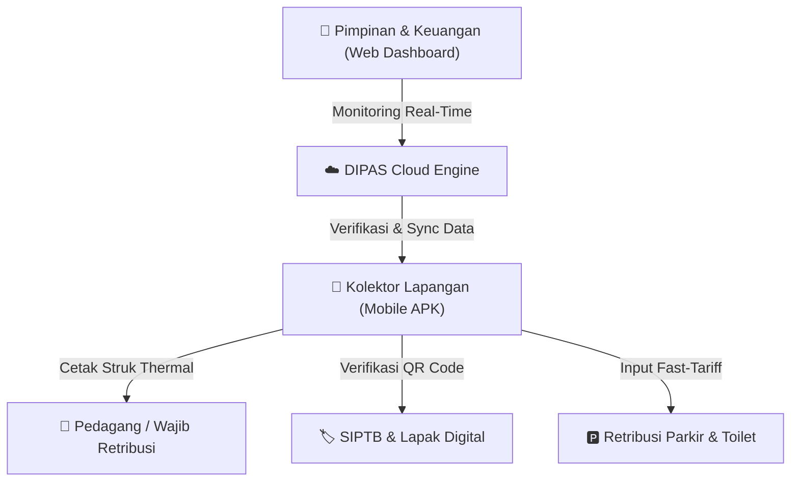
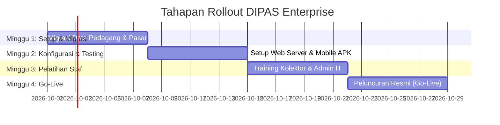

# 📊 DIPAS ENTERPRISE v2.0 — PROPOSAL & PRESENTASI KLIEN
> **Platform Digitalisasi Sentral Kontrol Pasar, Retribusi Lapangan, SIPTB & Parkir Terpadu**

---

## 📸 Slide Visual Showcase (Carousel Antarmuka)

```carousel

<!-- slide -->

<!-- slide -->

<!-- slide -->

```

---

## 🎯 DECK PRESENTASI KLIEN (SLIDE BY SLIDE)

### 📌 SLIDE 1: HALAMAN UTAMA (COVER)
- **Judul**: Digitalisasi Pengelolaan Pasar & Penerimaan Daerah Terpadu
- **Sub-Judul**: Transformasi Menuju Transparansi 100%, Efisiensi Lapangan, dan Optimalisasi PAD Berbasis *DIPAS Enterprise v2.0*
- **Target Audience**: Pimpinan Pemda, Kepala Dinas Perdagangan/Pasar, Direksi BUMD Pasar, Tim BAPENDA / Keuangan Daerah.

---

### 📌 SLIDE 2: TANTANGAN OPERASIONAL SAAT INI (PROBLEM STATEMENT)

> [!WARNING]
> **Permasalahan Utama Pengelolaan Retribusi Manual:**
> 1. **Potensi Kebocoran PAD (30% - 50%):** Transaksi kuitansi fisik/kertas rentan manipulasi & tidak tercatat *real-time*.
> 2. **Data Pedagang & Lapak Tidak Valid:** Penjualan/pengalihan hak penempatan (SIPTB) tanpa sepengetahuan dinas/pengelola.
> 3. **Proses Rekapitulasi Lambat:** Rekapitulasi kas harian membutuhkan waktu berhari-hari dan berisiko salah hitung.
> 4. **Kurangnya Pengawasan Kolektor Lapangan:** Tidak ada *geolocation tracking* dan audit trail transaksi secara presisi.

---

### 📌 SLIDE 3: SOLUSI DIPAS ENTERPRISE v2.0

DIPAS Enterprise hadir sebagai **Ekosistem Digital End-to-End** yang menghubungkan seluruh pemangku kepentingan:



---

### 📌 SLIDE 4: PILAR UTAMA KEUUNGGULAN DIPAS

| Pilar Utama | Solusi DIPAS Enterprise | Dampak Bagi Klien |
|---|---|---|
| **1. Mobile Collector APK** | Transaksi lapangan via smartphone + Printer Thermal Bluetooth | Pungutan instan & cetak struk sah tempat |
| **2. Offline-First Tech** | Aplikasi tetap bekerja meskipun koneksi internet terputus | Operasional 100% tanpa kendala sinyal |
| **3. Real-Time Audit Trail** | Log transaksi, koordinat GPS kolektor, dan verifikasi QR | Mencegah penyimpangan & manipulasi |
| **4. Executive Dashboard** | Analytic heatmap okupansi pasar, grafik target vs realisasi | Keputusan strategis berbasis data presisi |

---

### 📌 SLIDE 5: FITUR-FITUR UNGGULAN APLIKASI

#### A. Web Enterprise (Sentral Kontrol IT & Manajemen)
- **Master Pedagang & Lapak:** Pemetaan digital posisi lapak, zonasi pasar, dan status kepemilikan.
- **SIPTB Digital:** Pengelolaan Surat Izin Penempatan Tempat Berjualan dengan QR Code anti-pemalsuan.
- **Target vs Realisasi PAD:** Monitoring persentase pencapaian pendapatan harian, bulanan, dan tahunan per pasar.
- **Audit Transparansi & System Log:** Rekam jejak seluruh aktivitas pengguna dan petugas secara transparan.

#### B. Mobile Collector APK (Operasional Lapangan)
- **Fast-Action Tariff:** Tombol cepat nominal retribusi (Pasar, Parkir Motor/Mobil, Toilet).
- **Cetak Struk Thermal Direct:** Konektivitas Bluetooth printer 58mm/80mm tanpa driver rumit.
- **Verifikasi Lapak QR:** Scan QR code lapak pedagang untuk melihat riwayat pembayaran & jatuh tempo.
- **Geotagging & Timestamp:** Setiap transaksi mencatat waktu dan koordinat lokasi penagihan.

---

### 📌 SLIDE 6: ESTIMASI IMPACT & RETURN ON INVESTMENT (ROI)

> [!TIP]
> **Analisis Dampak Implementasi DIPAS Enterprise:**
> - 📈 **Peningkatan Penerimaan (PAD):** Naik **+35% s/d +60%** pada 3 bulan pertama akibat penutupan celah kebocoran.
> - ⚡ **Efisiensi Rekapitulasi Data:** Dari **3-5 Hari** manual menjadi **Real-Time (0 Detik)** secara otomatis.
> - 🛡️ **Tingkat Akurasi Audit:** **100% Transparan** dengan integrasi struk digital & audit log.

---

### 📌 SLIDE 7: ROADMAP IMPLEMENTASI (4 MINGGU IMPLEMENTASI)



---

### 📌 SLIDE 8: DEMO LIVE APLIKASI DENGAN KLIEN

Saat presentasi langsung dengan klien, buka tautan demo berikut untuk memberikan peragaan *live*:

- **Portal Web Admin:** [http://localhost:8088/index.html](http://localhost:8088/index.html)
- **Aplikasi Mobile Petugas:** [http://localhost:8088/mobile-apk.html](http://localhost:8088/mobile-apk.html)
- **Modul Parkir & Toilet:** [http://localhost:8088/mobile-parkir.html](http://localhost:8088/mobile-parkir.html)

---

## 💼 PANDUAN PENYAMPAIAN (PITCHING TIPS UNTUK ANDA)

1. **Buka dengan Problem (Slide 2):** Tekankan berapa besar potensi kebocoran retribusi jika masih menggunakan kuitansi kertas manual.
2. **Tampilkan Visual Live / Simulator (Slide 8):** Tunjukkan betapa cepatnya petugas menagih retribusi dan mencetak struk thermal langsung dari HP.
3. **Soroti Keamanan & Transparansi (Slide 5):** Jelaskan bahwa Pimpinan Pemda dapat memantau uang masuk detik demi detik langsung dari ruang kerja.
4. **Tutup dengan ROI (Slide 6):** Tekankan bahwa biaya investasi sistem akan tertutup dengan cepat oleh peningkatan PAD yang signifikan.
